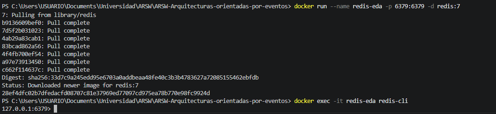
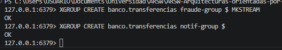
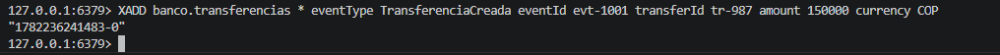
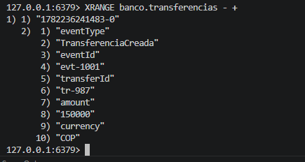
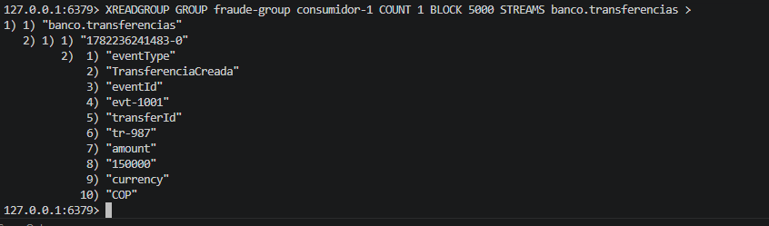
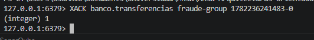
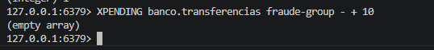
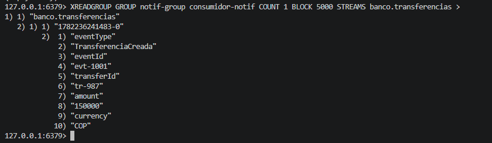
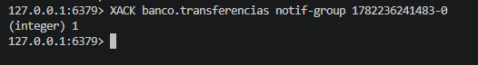

# ARSW - Arquitecturas Orientadas por Eventos (EDA) con Redis

## Resumen

Una **Arquitectura Orientada por Eventos (EDA)** organiza los servicios alrededor de hechos de negocio que ya ocurrieron, en lugar de llamadas directas entre servicios. Un servicio publica un evento ("TransferenciaCreada") y otros servicios reaccionan de forma independiente, sin que el productor sepa quién los consume.

Redis actúa como **broker liviano** usando **Redis Streams**, que ofrece persistencia del evento, grupos de consumidores independientes, confirmación (ACK) y capacidad de reprocesamiento, características que lo hacen superior al Pub/Sub simple para flujos de negocio confiables.

---

## Conceptos Clave

| Término | Definición |
|---|---|
| **Evento** | Hecho que ya ocurrió. Ej.: `TransferenciaCreada` |
| **Productor** | Servicio que publica el evento; no sabe quién lo consumirá |
| **Consumidor** | Servicio que reacciona al evento; puede escalar en grupo |
| **Broker** | Infraestructura que recibe, ordena y entrega eventos |
| **Stream / Topic** | Canal lógico por tipo de evento. Ej.: `banco.transferencias` |
| **Idempotencia** | Procesar el mismo evento dos veces sin duplicar efectos de negocio |
| **ACK** | Confirmación de que un consumidor procesó exitosamente el evento |
| **Consumer Group** | Conjunto de consumidores que comparten el avance de lectura en un stream |

---

## Flujo Típico

```
API recibe solicitud → Productor crea evento → Broker guarda en stream → Consumidor procesa → ACK confirma lectura
```

Si un consumidor cae antes del ACK, el evento queda **pendiente** y puede ser reclamado y reintentado por otro consumidor del mismo grupo.

---

## Ejemplo de Evento de Negocio

Evento `TransferenciaCreada`:

```json
{
  "eventId": "evt-1001",
  "transferId": "tr-987",
  "from": "cta-101",
  "to": "cta-202",
  "amount": "150000",
  "currency": "COP",
  "createdAt": "2026-06-23T10:15:00"
}
```

**Reglas de diseño del evento:**
- Nombre en pasado (el hecho ya ocurrió)
- Payload suficiente para consumir sin consultar otras fuentes
- `eventId` único para garantizar idempotencia
- `createdAt` para auditoría y orden lógico

## Buenas Prácticas

- Nombrar eventos en pasado con versión: `TransferenciaCreada.v1`
- Garantizar idempotencia usando `eventId` único por evento
- Separar grupos de consumidores por responsabilidad de negocio
- Definir estrategia de reintentos y un **dead-letter stream** para errores
- Monitorear latencia, pendientes por grupo y tamaño del stream
- Documentar contratos de eventos como parte del diseño arquitectural

---

## Actividad

### Paso 1 — Levantar Redis y crear el stream

```bash
docker run --name redis-eda -p 6379:6379 -d redis:7
```

```bash
docker exec -it redis-eda redis-cli
```


Dentro del cliente `redis-cli`, crear los grupos de consumidores:

```bash
XGROUP CREATE banco.transferencias fraude-group $ MKSTREAM
```

```bash
XGROUP CREATE banco.transferencias notif-group $
```

> `MKSTREAM` crea el stream automáticamente si no existe. Cada grupo tiene su propio puntero de lectura independiente.


---

### Paso 2 — Publicar eventos con XADD

```bash
XADD banco.transferencias * eventType TransferenciaCreada eventId evt-1001 transferId tr-987 amount 150000 currency COP
```


Ver todos los eventos publicados en el stream:

```bash
XRANGE banco.transferencias - +
```

> Redis asigna un ID como `1719148500000-0` al evento. Ese ID permite recuperarlo, ordenarlo y trazarlo.



---

### Paso 3 — Consumir en grupo y confirmar con ACK

Leer el próximo evento como `consumidor-1` del grupo `fraude-group`:

```bash
XREADGROUP GROUP fraude-group consumidor-1 COUNT 1 BLOCK 5000 STREAMS banco.transferencias >
```



Confirmar que el evento fue procesado exitosamente (reemplaza el ID con el que devolvió Redis):

```bash
XACK banco.transferencias fraude-group 1719148500000-0
```



Revisar eventos pendientes (no confirmados) en el grupo:

```bash
XPENDING banco.transferencias fraude-group - + 10
```



> - `>` le indica a Redis que entregue solo eventos **nuevos** para ese grupo.  
> - Si el consumidor cae antes del ACK, el evento queda pendiente.  
> - Otro consumidor puede reclamarlo con `XCLAIM` y reintentarlo.  
> - El ACK no borra el evento del stream; solo avanza el cursor del grupo.

---

### Paso 4 — Verificar con el segundo grupo (notif-group)

El mismo evento es visible para el grupo de notificaciones de forma independiente:

```bash
XREADGROUP GROUP notif-group consumidor-notif COUNT 1 BLOCK 5000 STREAMS banco.transferencias >
```



```bash
XACK banco.transferencias notif-group 1719148500000-0
```

> Ambos grupos (`fraude-group` y `notif-group`) consumen el mismo evento sin competir entre sí. Cada uno tiene su propia confirmación.



---

## Redis Pub/Sub vs Redis Streams

| Característica | Pub/Sub | Streams |
|---|---|---|
| Persistencia | No | Sí |
| Consumidor desconectado | Pierde el mensaje | Queda pendiente |
| Grupos de consumidores | No | Sí |
| ACK y reintentos | No | Sí |
| Reprocesamiento | No | Sí |
| **Uso recomendado** | Señales efímeras | **Eventos de negocio** |

---

